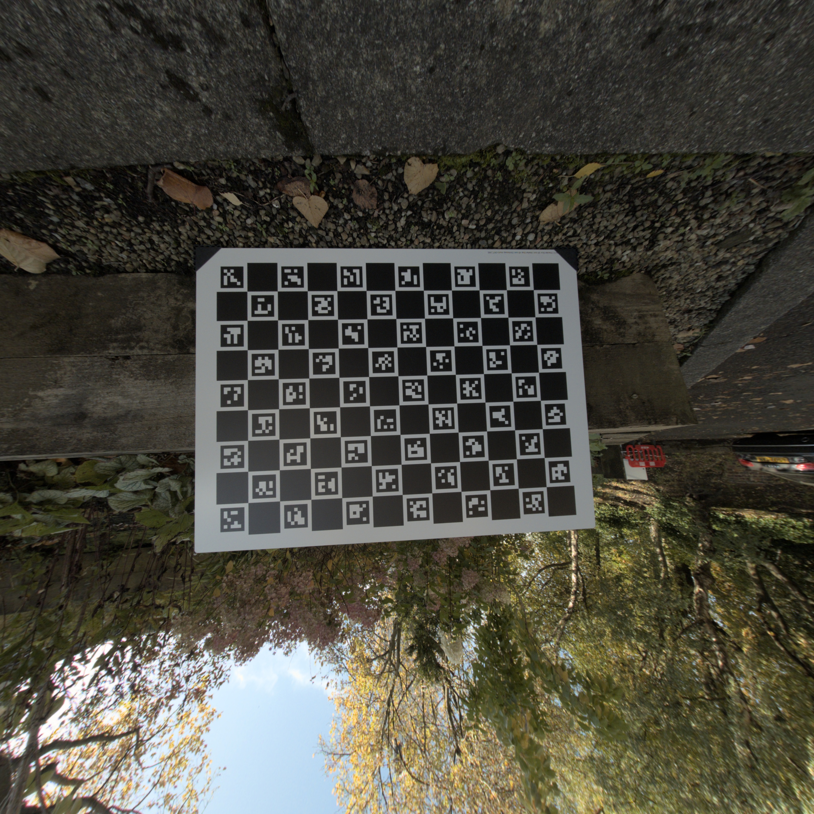
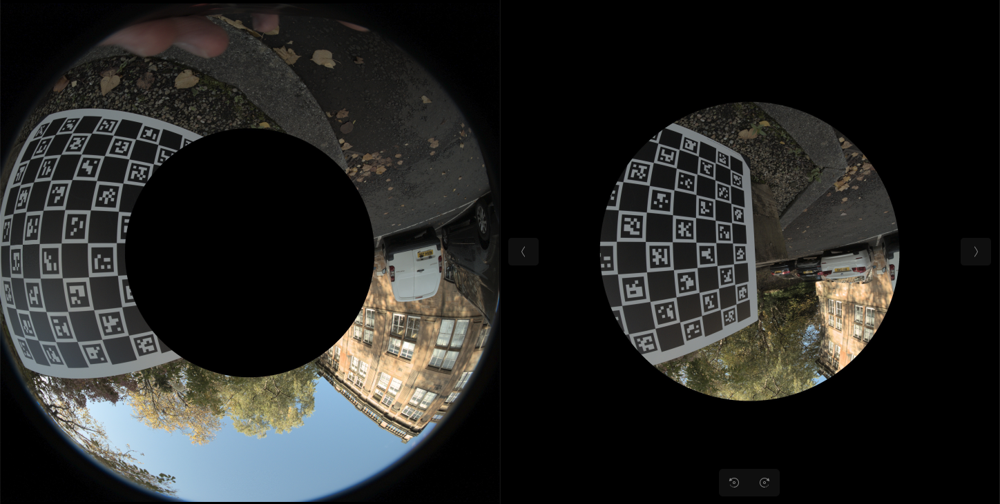

# 鱼眼相机 ChArUco 标定

### 项目概述

本项目提供了一个用于通过 ChArUco 标定板标定相机的 Python 类。它结合 OpenCV 中现有的 `cv.aruco` 和 `cv.fisheye` 模块，可用于鱼眼相机标定，同时也支持针孔相机。


### 快速开始

由于项目依赖特定版本的 OpenCV 及其他库，强烈建议使用虚拟环境运行本项目。可以使用以下命令创建并激活虚拟环境：

```
python -m venv myenv
source myenv/bin/activate  # macOS/Linux
myenv\Scripts\activate     # Windows

python -m pip install --upgrade pip  # 推荐执行，但不是必需的
```

只需输入以下命令即可退出虚拟环境：

```
deactivate
```

接下来安装并运行本项目：

```
pip install setuptools
pip install -e . -i https://pypi.tuna.tsinghua.edu.cn/simple
```

执行后将安装所有依赖项，并且可以在该虚拟环境中的任意 Python 文件里导入项目模块。

### 项目结构

仓库中包含以下源码目录：

```
├── docs
│   └── README_images
├── scripts
│   └── calibration_gui.py
├── src
│   ├── calibration             # 标定算法、GUI 和实时矫正工作流
│   └── virtual_camera
└── tests
```

项目脚本还会使用根目录下的 `data/` 作为运行时数据目录。该目录已被 `.gitignore` 忽略，因此克隆仓库后默认不存在。首次使用前，会自动在项目根目录创建文件夹；


创建后的运行时数据目录结构如下：

```
├── data
│   ├── calibration
│   │   ├── camera_intrinsics      # 按分辨率保存相机标定参数
│   │   │   ├── 640x480
│   │   │   └── 1920x1080
│   │   ├── images                 # 按分辨率保存 ChArUco 标定照片
│   │   │   ├── 640x480
│   │   │   └── 1920x1080
│   │   └── detected_images        # 每次标定保存带检测标记的识别图
│   │       └── 1920x1080
│   ├── raw_images
│   │   └── descent_1              # 手动放入：需要去畸变的原始照片
│   ├── realtime_captures          # GUI 保存的实时原图和矫正对比图
│   │   └── 1920x1080
│   ├── undistorted_images         # 程序输出：去畸变后的图像
│   │   ├── fisheye
│   │   └── pinhole
│   └── virtual_cameras            # 程序输出：虚拟相机分割图像
├── docs
│   └── README_images
├── scripts
├── src
│   ├── calibration
│   └── virtual_camera
└── tests
```

需要手动放入图像的目录只有以下两个：

- `data/calibration/images/<宽>x<高>/`：放置对应分辨率下拍摄的 ChArUco 标定板照片，用于计算该分辨率的相机内参和畸变参数。GUI 会自动创建和选择该目录。
- `data/raw_images/descent_1/`：放置需要进行去畸变处理的原始照片。当前的 `run_calibration.py` 和 `undistort_images.py` 默认读取该子目录；如果使用其他目录，需要同时修改脚本中的 `raw_images_dir`。

其余目录用于保存程序输出：

- `data/calibration/camera_intrinsics/<宽>x<高>/`：保存对应分辨率的鱼眼或针孔相机标定参数文件。
- `data/calibration/detected_images/<宽>x<高>/<时间戳_模型>/`：每次点击“开始计算标定参数”时，保存所有标定照片的检测识别结果。图中会标出 ArUco 边框和 ID、ChArUco 角点，并在左上角显示该图是否参与标定以及检测数量。
- `data/realtime_captures/<宽>x<高>/`：保存 GUI 捕获的原图、当前 balance 矫正图和多 balance 对比图。
- `data/undistorted_images/fisheye/`：保存使用鱼眼模型去畸变后的图像。
- `data/undistorted_images/pinhole/`：保存使用针孔模型去畸变后的图像。
- `data/virtual_cameras/`：保存虚拟相机分割生成的图像。

## PySide6 相机标定与实时矫正界面

项目提供了一个可视化桌面应用，支持：

- 打开 `/dev/video0` USB 鱼眼相机并显示原始实时画面。
- 从实时画面拍摄 ChArUco 标定照片，保存前自动检查标记和角点。
- 使用鱼眼模型或针孔模型计算相机内参矩阵 `K`、畸变系数 `D`、RMS 重投影误差、每张图片的误差和 COLMAP 参数。
- 加载已有标定参数。
- 同时显示原始实时画面和去畸变后的实时画面。
- 使用 `balance` 参数调整矫正后的视场范围。
- 按相机实际分辨率自动隔离标定照片和 JSON 参数，避免混用不同分辨率。
- 计算标定参数时自动保存每张标定照片的 ArUco/ChArUco 检测识别图，方便检查漏检和坏图。
- 第一遍标定后根据每张图片的重投影误差自动识别离群图，剔除后再进行第二遍标定。
- 一键保存原图、当前矫正图、并排对比图以及多个 balance 的 2×2 对比图。

### 安装 GUI 依赖

执行前文的 `pip install -e .` 会同时安装 GUI 所需的 PySide6 Essentials。如果之前已经安装过本项目，请补充执行：

```bash
python -m pip install PySide6-Essentials==6.7.2
```

### 启动界面

在项目根目录执行：

```bash
python scripts/calibration_gui.py
```

### GUI 使用流程

1. 在“相机设备”中选择 `/dev/video0`。如果重新插拔后设备编号发生变化，点击“刷新设备”。
2. 选择 `1920 × 1080` 和 `60 FPS`。程序会优先使用 USB 相机支持的 MJPG 格式。
3. 确认界面中的标定板参数为：

   ```text
   ArUco 字典：DICT_5X5_100
   纵向方格（Y）：9
   横向方格（X）：14
   方格边长：20 mm
   标记边长：15 mm
   旧版布局兼容：关闭
   ```

   注意：虽然这块标定板经常竖着摆放，看起来是“纵向 14、横向 9”，但根据板上 ArUco 标记 ID 的排列，它在厂家/OpenCV 坐标中实际是横向 X=14、纵向 Y=9。旋转标定板不会改变该配置。如果填写成纵向 14、横向 9，会出现能检测到几十个 ArUco 标记、但 ChArUco 角点为 0 的情况。

4. 点击“打开相机”，左侧会显示原始实时画面。
5. 从不同角度、距离和画面位置拍摄 15～25 张标定照片。点击“拍摄标定照片”或按空格键即可拍照。照片会按实际分辨率自动保存，例如 `data/calibration/images/1920x1080/`；如果检测到的角点太少，程序不会保存该照片。
6. 选择“鱼眼模型（推荐）”，点击“开始计算标定参数”。计算过程在后台线程执行，不会冻结相机画面。
7. 计算过程中，程序会把每张照片的检测识别结果保存到本次计算专用目录，例如：

   ```text
   data/calibration/detected_images/1920x1080/20260731_120000_000_fisheye/
   ```

   识别图左上角的 `USED` 表示最终参与标定，`OUTLIER` 表示第一遍标定后因单图误差明显偏高而被自动剔除，`SKIPPED` 表示角点不足而被跳过；同时会显示检测数量、单图误差和自动剔除阈值。原始标定照片不会被修改。

   自动剔除采用中位数和 MAD 稳健统计量：至少有 10 张有效图片时才启用，阈值为 `max(中位数 + 3 × 稳健标准差, 中位数 × 2)`，一次最多剔除总图片数的 20%，并始终保留至少 5 张。这可以自动去掉误差特别突出的坏图，同时避免因普通波动误删过多照片。
8. 标定完成后，界面会显示相机内参、畸变系数、误差和 COLMAP 参数，并保存：

   ```text
   data/calibration/camera_intrinsics/1920x1080/fisheye_calibration.json
   ```

9. 点击“开始实时矫正”，右侧会显示实时去畸变画面，左侧继续显示原始画面，便于直接对比。
10. “边缘压缩”默认值为 `0.00`，即使用标准 OpenCV 鱼眼投影，恢复到稳定的常规去畸变效果。该参数大于 `0` 时会改用实验性的外围投影压缩，可能改变边缘直线形状；如需复现本项目原来的效果，请保持为 `0.00`。
11. 调整 `balance`：默认值为 `0.00`，表示从完整去畸变结果中计算最大的无黑边安全矩形并裁剪；设置为 `1.00` 时保留完整视场，外围可能出现黑色无效区域。实时预览和保存的 ROI 均使用同一套标准去畸变映射。
12. 点击“保存矫正对比”，程序会在 `data/realtime_captures/<分辨率>/<时间戳>/` 中保存：

    ```text
    original.jpg                         # 原始实时画面
    corrected_balance_0.50.jpg           # 当前 balance 的矫正图
    corrected_full.jpg                   # 标准鱼眼去畸变后的完整画面（含无效黑边）
    corrected_full_with_roi_balance_0.50.jpg
                                         # 完整去畸变画面，并用绿框标出当前 ROI
    original_vs_corrected_0.50.jpg        # 原图和去畸变结果并排对比
    balance_comparison.jpg                # 各 balance 在完整去畸变图上的 ROI
    cropped_balance_comparison.jpg        # 各 balance 实际裁剪结果；仅此图会统一缩放展示
    metadata.json                         # 分辨率、模型、参数路径等信息
    ```

程序默认使用 OpenCV 鱼眼模型根据当前分辨率对应的内参矩阵 `K` 和畸变系数 `D` 计算标准去畸变坐标映射。完整结果保留实际映射产生的有效区域；没有源像素对应的位置显示为黑色无效区域，不额外应用透明边缘、可信边界或人工四边压缩。随后根据有效掩膜计算绿色安全 ROI：`balance=0` 为最大无黑边矩形，`balance=1` 为完整视场，中间值在两者之间插值。

实时矫正、`corrected_full.jpg` 和 `corrected_balance_*.jpg` 使用同一套标准映射。这样可以直接观察鱼眼畸变被校正后的真实直线效果，同时通过绿色框查看最终建议裁剪范围。

旧版本直接保存在 `data/calibration/images/` 根目录中的混合分辨率照片，会在新版 GUI 下次启动时根据图片实际尺寸自动移动到对应的分辨率子目录。旧版根目录 JSON 参数也会复制到对应的分辨率参数目录。

如果矫正画面看起来偏软，请确认相机实际工作在 `1920×1080`。`640×480` 画面在 GUI 中被放大显示后会明显变模糊；正式标定和实时矫正均建议使用相同的 `1920×1080` 分辨率。

拍摄标定照片时，应让标定板分别出现在画面中心、四角和边缘，并包含正视、倾斜和旋转姿态。避免只在同一个位置连续拍摄，否则即使照片数量足够，标定结果也可能不准确。

### 命令行操作

以下命令均需在项目根目录执行。

#### 1. 检查标定板参数

打开 `scripts/run_calibration.py` 和 `scripts/undistort_images.py`，确认以下参数与实际拍摄时使用的 ChArUco 标定板一致：

```python
ARUCO_DICT = cv2.aruco.DICT_5X5_100
SQUARES_VERTICALLY = 9
SQUARES_HORIZONTALLY = 14
SQUARE_LENGTH = 0.020
MARKER_LENGTH = 0.015
```

各参数含义如下：

- `ARUCO_DICT`：指定标定板使用的 ArUco 标记字典。`cv2.aruco.DICT_5X5_100` 表示每个标记内部由 `5 × 5` 个二进制格组成，该字典最多提供 100 个不同编号的标记。此参数必须与制作或打印标定板时使用的字典一致。
- `SQUARES_VERTICALLY`：ChArUco 标定板在厂家/OpenCV 坐标中纵向（Y）的方格数量。当前值为 `9`。
- `SQUARES_HORIZONTALLY`：ChArUco 标定板在厂家/OpenCV 坐标中横向（X）的方格数量。当前值为 `14`。
- `SQUARE_LENGTH`：每个棋盘方格的实际边长。当前值为 `0.020` 米，即 `20 毫米`。
- `MARKER_LENGTH`：每个 ArUco 标记的实际边长。当前值为 `0.015` 米，即 `15 毫米`。

`SQUARE_LENGTH` 和 `MARKER_LENGTH` 必须使用相同的长度单位，并且 `MARKER_LENGTH` 应小于 `SQUARE_LENGTH`。上述五个参数必须与实际拍摄的 ChArUco 标定板完全一致，否则可能无法正确检测角点，或者会得到错误的标定结果。

#### 2. 激活虚拟环境

```bash
source myenv/bin/activate  # macOS/Linux
```

Windows：

```powershell
myenv\Scripts\activate
```

如果尚未安装项目，请先执行前文“快速开始”中的安装命令。

#### 3. 执行相机标定

```bash
python scripts/run_calibration.py
```

该脚本会读取 `data/calibration/images/` 中的 ChArUco 标定板照片，检测标记和角点，然后分别使用鱼眼模型和针孔模型计算相机参数。

执行成功后会生成：

```text
data/calibration/camera_intrinsics/
├── fisheye_calibration.json   # 鱼眼相机模型参数
└── pinhole_calibration.json   # 针孔相机模型参数
```

两个 JSON 文件主要包含：

- `K`：相机内参矩阵，其中包括焦距 `fx`、`fy` 和主点 `cx`、`cy`。
- `D`：镜头畸变系数。

终端还会显示相机内参矩阵、畸变系数、实际参与标定的照片数量，以及可供 COLMAP 使用的相机参数。对于鱼眼镜头，通常使用 `fisheye_calibration.json`。

此步骤只计算并保存相机参数，不会生成去畸变后的图片。

如果终端提示没有检测到 ChArUco 角点，请检查标定板参数是否正确、照片是否清晰，以及标定板是否在图像中占有足够面积。

#### 4. 批量去畸变

标定成功并生成上述 JSON 文件后，执行：

```bash
python scripts/undistort_images.py
```

该脚本会执行以下操作：

1. 读取 `data/raw_images/descent_1/` 中的全部原始图片。
2. 加载上一步生成的鱼眼和针孔标定参数文件。
3. 分别使用鱼眼模型和针孔模型对每张图片进行去畸变处理。
4. 将处理后的图片分别输出到：

```text
data/undistorted_images/
├── fisheye/   # 使用鱼眼模型处理后的图片
└── pinhole/   # 使用针孔模型处理后的图片
```

例如，放入以下原始图片：

```text
data/raw_images/descent_1/image_001.jpg
```

处理完成后会得到：

```text
data/undistorted_images/fisheye/image_001.jpg
data/undistorted_images/pinhole/image_001.jpg
```

原始图片不会被修改。对于鱼眼镜头，应优先查看 `fisheye/` 中的结果，也可以对比两个目录中的图片，判断哪种模型的校正效果更自然。

可以修改 `scripts/undistort_images.py` 中的 `balance` 参数调整输出视场范围；当前默认值为 `1`。

下文进一步介绍了核心类，以帮助理解项目或排查问题。如果没有标定图像，可以使用下面的代码在屏幕上生成标定板，然后拍摄标定图像。

## 用于相机标定的 ChArUco 标定板

ChArUco 标定板是一种结合棋盘格图案与 ArUco 标记的混合标定图案。与传统标定方法相比，它具有以下优点：

1. 即使存在部分遮挡，也能进行稳定检测
2. 自动且准确地检测角点
3. 每个角点都有唯一标识

### 生成 ChArUco 标定板

`CharucoCalibrator` 类提供了生成 ChArUco 标定板的方法：

```python
calibrator.generate_charuco_board()
```


该方法会创建一张 ChArUco 标定板图像，并以 `charuco_board.png` 为文件名保存到 `data/calibration/` 目录中。

### 关键参数

初始化标定器时，以下参数用于定义 ChArUco 标定板：

- `aruco_dict`：使用的 ArUco 字典（例如 `cv2.aruco.DICT_5X5_100`）
- `squares_vertically`：ChArUco 标定板纵向的方格数量
- `squares_horizontally`：ChArUco 标定板横向的方格数量
- `square_length`：ChArUco 标定板中每个方格的实际边长（使用自行选择的单位，例如米）
- `marker_length`：ChArUco 标定板中每个 ArUco 标记的实际边长（单位应与 `square_length` 相同）

### 拍摄标定照片

为了获得准确的标定结果，拍摄 ChArUco 标定板图像时请遵循以下建议：

1. 将生成的 ChArUco 标定板打印并固定在平整、坚硬的表面上。
2. 确保光线充足且均匀，避免阴影或反光。
3. 从不同角度和距离拍摄 10～20 张标定板图像。
4. 拍摄的图像应覆盖相机的整个视场。
5. 部分图像中的标定板应有一定倾斜或旋转。
6. 确保大多数图像中都能看到完整的标定板。
7. 拍摄时保持相机和标定板静止，避免运动模糊。

### 标定流程

标定流程包括以下步骤：

1. 生成并打印 ChArUco 标定板。
2. 按照上述说明拍摄多张标定板照片。
3. 将标定图像放入指定的 `calibration_images_dir`。
4. 运行 `FisheyeCalibrator` 或 `PinholeCalibrator` 的 `calibrate()` 方法。

### 其他实用方法

`CharucoCalibrator` 类还提供了以下用于处理 ChArUco 标定板的方法：

- `generate_blank_board()`：创建一张空白黑色标定板，以便进行自定义修改。
- `detect_aruco_markers()`：检测图像中的 ArUco 标记。
- `detect_charuco_corners()`：检测图像中的 ChArUco 角点。
- `show_aruco_markers()`：显示图像中检测到的 ArUco 标记。
- `show_charuco_corners()`：显示图像中检测到的 ChArUco 角点。

这些方法可用于验证标定图像的质量，以及排查标定过程中出现的问题。

## FisheyeCalibrator

`FisheyeCalibrator` 类是一款专为鱼眼相机设计的标定工具。它继承自 `CharucoCalibrator` 基类，提供了使用 ChArUco 标定板标定鱼眼相机、校正鱼眼图像畸变以及导出相机参数的方法。

### 主要功能

1. 针对鱼眼相机的标定
2. 鱼眼镜头图像去畸变
3. 以 COLMAP 格式导出相机参数

### 使用方法

#### 初始化

```python
fisheye_calibrator = FisheyeCalibrator(
    aruco_dict,
    squares_vertically,
    squares_horizontally,
    square_length,
    marker_length,
    calibration_images_dir,
    raw_images_dir
)
```

#### 标定

```python
fisheye_calibrator.calibrate(
    grayscale=True,
    calibration_filename='fisheye_calibration.json',
    window_size=(480, 480),
    verbose=False
)
```

该方法执行以下步骤：

1. 检测标定图像中的 ChArUco 角点
2. 收集物体点和图像点
3. 使用 `cv2.fisheye.calibrate` 执行鱼眼相机标定
4. 将标定参数保存到 JSON 文件

#### 图像去畸变

```python
undistorted_image = fisheye_calibrator.undistort_image(
    image,
    image_name=None,
    calibration_filename='fisheye_calibration.json',
    balance=1,
    show_image=True,
    save_image=True,
    output_path=None,
    window_size=(480, 480)
)
```



该方法会：

1. 加载标定参数
2. 使用 `cv2.fisheye.undistortImage` 对输入图像进行去畸变处理
3. 根据配置显示和保存去畸变后的图像

#### 导出相机参数

```python
fisheye_calibrator.export_camera_params_colmap(calibration_path=None)
```

该方法以 COLMAP 格式导出相机参数，其中包括：

- 焦距（`fx`、`fy`）
- 主点（`cx`、`cy`）
- 畸变系数（`k1`、`k2`、`k3`、`k4`）

### 关键方法

1. `calibrate()`：使用 ChArUco 标记执行鱼眼相机标定。
2. `undistort_image()`：使用已标定的参数对鱼眼图像进行去畸变处理。
3. `export_camera_params_colmap()`：以 COLMAP 格式导出相机参数。

## ConcentricCamera 类

`ConcentricCamera` 类是一种虚拟相机实现，用于将图像划分为多个同心圆区域。对于超广角鱼眼相机，图像外围区域所需的 OpenCV 畸变参数可能不同于中心区域，因此该类旨在帮助按不同视场角（FOV）拆分标定过程。

主要功能：

- 同心圆分割：根据指定的半径比例，将图像划分为多个同心圆区域。
- 灵活配置：支持配置多个分割区域和自定义重叠比例。
- 自动处理：自动处理输入目录中的所有图像，并将分割后的图像保存到指定的输出目录。



### 初始化

使用 `ConcentricCamera` 类时，需要通过输入和输出目录路径、所需的分割比例以及重叠比例对其进行初始化。

参数：

- **input_folder (str)：** 包含输入图像的目录路径。图像格式可以是 `.jpg`、`.jpeg`、`.png`、`.bmp` 和 `.tiff`。
- **output_folder (str)：** 保存处理后图像的目录路径。
- **splits (list of float)：** 用于将图像划分为同心圆的半径比例列表，取值范围为 0 到 1。每个比例表示对应同心圆区域的外半径，其基准为图像高度和宽度中较小的尺寸。
- **overlap_ratio (float)：** 相邻区域之间的重叠比例，用于定义各同心圆区域相互重叠的程度。

```python
concentric_cam = ConcentricCamera(
    input_folder="path/to/input/folder",
    output_folder="path/to/output/folder",
    splits=[0.3, 0.6, 0.9],
    overlap_ratio=0.1
)
```

### 创建 ConcentricCamera 实例

```python
concentric_cam = ConcentricCamera(
    input_folder="path/to/input/folder",
    output_folder="path/to/output/folder",
    splits=[0.5, 0.8],  # 使用比例定义分割区域
    overlap_ratio=0.05  # 定义重叠比例
)

# 处理输入目录中的每张图像
for image_path in concentric_cam.input_image_list:
    concentric_cam.split_image(image_path)
```

该代码会读取输入目录中的每张图像，按照指定的半径比例将其分割为多个同心圆区域，并将处理后的各区域保存到指定的输出目录中。每个区域会存储在以分割序号命名的子目录中，例如 `camera_0`、`camera_1` 等。
