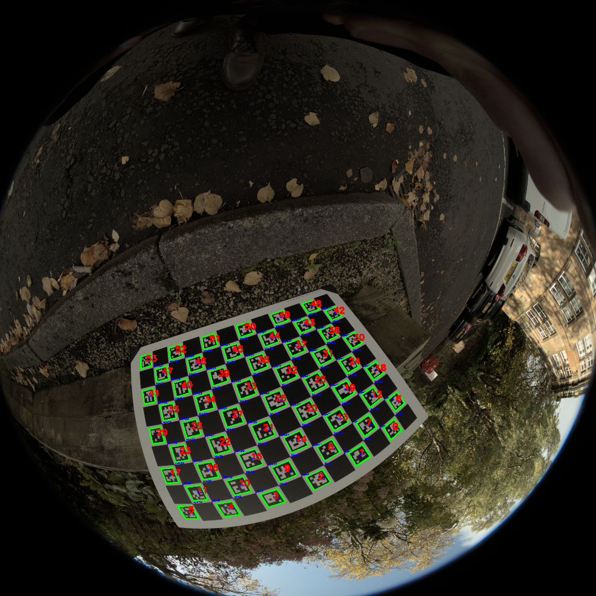

# 鱼眼相机 ChArUco / 棋盘格标定工具

[English README](README.md)

本项目提供 Windows 和 Linux 通用的相机标定桌面应用，支持 USB/UVC 相机、ChArUco 与传统棋盘格、鱼眼与针孔模型、实时去畸变、标定批次归档和批量图片矫正。



## 目录

- [主要功能](#主要功能)
- [系统要求](#系统要求)
- [安装环境](#安装环境)
- [快速启动](#快速启动)
- [Windows 与 Linux 相机兼容](#windows-与-linux-相机兼容)
- [GUI 标定流程](#gui-标定流程)
- [数据和输出目录](#数据和输出目录)
- [批量图片矫正](#批量图片矫正)
- [Python API](#python-api)
- [标定质量建议](#标定质量建议)
- [旧版数据迁移](#旧版数据迁移)
- [常见问题](#常见问题)
- [开发与测试](#开发与测试)

## 主要功能

- 在 Windows 上读取 DirectShow 相机名称和数字索引，在 Linux 上枚举 `/dev/video*` 并读取 V4L2 设备名称。
- Windows 按 DirectShow、Media Foundation、OpenCV 自动后端依次回退；Linux 按 V4L2、OpenCV 自动后端回退。
- 支持 ChArUco 和传统黑白棋盘格。
- 支持 OpenCV 鱼眼模型和针孔模型。
- 从实时画面拍摄标定照片，并在保存前检查角点数量。
- 按实际分辨率隔离照片、标定参数和检测结果，避免混用不同分辨率的数据。
- 自动保存每张标定图的角点检测结果，并根据单图重投影误差剔除明显离群图。
- 同时显示原始画面和实时去畸变画面。
- 使用 `balance` 调整视场范围，使用“边缘压缩”控制外围投影。
- 保存原图、矫正图、ROI、并排对比图和多组 `balance` 对比图。
- 将当前标定照片和已有参数归档后创建新的空批次。
- 使用命令行批量矫正已有图片。

## 系统要求

| 项目 | 要求 |
| --- | --- |
| 操作系统 | Windows 10/11，或带 V4L2 的主流 Linux 发行版 |
| Python | 3.10、3.11 或 3.12；推荐 3.10 |
| 相机 | OpenCV 可访问的 USB/UVC 相机或系统视频设备 |
| OpenCV | `opencv-contrib-python==4.12.0.88` |
| NumPy | `numpy==2.2.6` |
| GUI | `PySide6-Essentials==6.7.2` |

项目应在仓库根目录执行命令。路径中尽量避免特殊字符，并确保当前用户对 `data/` 目录具有写权限。

## 安装环境

### 方式一：Miniforge（推荐）

Miniforge 能在 Windows 和 Linux 上统一 Python 版本与环境管理，适合开发、测试和现场部署。

1. 从 [Miniforge 官方仓库](https://github.com/conda-forge/miniforge) 安装对应系统版本。
2. Windows 打开 “Miniforge Prompt”，Linux 打开终端。
3. 进入项目根目录并执行：

```bash
conda env create -f environment.yml
conda activate fisheye-charuco
```

`environment.yml` 会创建 Python 3.10 环境，并以 editable 模式安装当前项目。`requirements.txt` 中的平台条件会自动生效：

- Windows 安装 `pygrabber`，用于读取 DirectShow 设备名称。
- Linux 不安装 `pygrabber`。
- Windows 自动跳过 `pexpect`、`ptyprocess` 等 POSIX 专用依赖。

不激活环境也可以直接启动：

```bash
conda run -n fisheye-charuco python scripts/calibration_gui.py
```

更新已有环境：

```bash
conda env update -n fisheye-charuco -f environment.yml --prune
```

删除环境：

```bash
conda env remove -n fisheye-charuco
```

### 方式二：Python venv

不希望安装 Conda 时，可以使用系统 Python 创建虚拟环境。

Windows PowerShell：

```powershell
py -3.10 -m venv myenv
myenv\Scripts\Activate.ps1
python -m pip install --upgrade pip setuptools
python -m pip install -e .
```

如果 PowerShell 禁止执行激活脚本，可在命令提示符中运行：

```bat
myenv\Scripts\activate.bat
```

Linux：

```bash
python3 -m venv myenv
source myenv/bin/activate
python -m pip install --upgrade pip setuptools
python -m pip install -e .
```

安装开发依赖：

```bash
python -m pip install -e ".[dev]"
```

### 验证环境

```bash
python -c "import cv2, numpy, PySide6; print(cv2.__version__, numpy.__version__)"
```

正常情况下会输出 OpenCV 和 NumPy 版本，不会出现模块导入错误。

## 快速启动

激活环境后，在项目根目录执行：

```bash
python scripts/calibration_gui.py
```

首次启动时，程序会自动创建需要的 `data/calibration/` 和 `data/realtime_captures/` 子目录。

GUI 默认设置：

| 设置 | 默认值 |
| --- | --- |
| 分辨率 | `640 × 480` |
| 帧率 | `30 FPS` |
| 相机模型 | 鱼眼模型 |
| 标定板 | ChArUco |
| ArUco 字典 | `DICT_5X5_100` |
| 方格数量 | 横向 X=`14`，纵向 Y=`9` |
| 方格边长 | `20 mm` |
| 标记边长 | `15 mm` |
| balance | `0.00` |
| 边缘压缩 | `0.00` |

## Windows 与 Linux 相机兼容

| 系统 | 设备发现 | 打开后端顺序 | 手动输入示例 |
| --- | --- | --- | --- |
| Windows | 优先读取 DirectShow 名称；失败时探测数字索引 | DirectShow → Media Foundation → OpenCV 自动 | `0`、`1` |
| Linux | 枚举 `/dev/video*`，并尽量读取 `/sys/class/video4linux` 中的名称 | V4L2 → OpenCV 自动 | `/dev/video0` |

设备下拉框可以编辑。Windows 通常显示 `1: USB Camera`；Linux 通常显示 `/dev/video0: USB Camera`，读取不到名称时只显示设备路径。

打开成功后，运行日志会显示实际使用的后端、分辨率、帧率和 FOURCC 视频格式。驱动可能不会接受请求的全部参数，应以日志中的实际格式为准。

## GUI 标定流程

### 1. 选择相机格式

1. 点击“刷新设备”并选择目标相机。
2. 选择分辨率和帧率。
3. 点击“打开相机”。
4. 确认日志中的实际分辨率和帧率符合预期。

正式标定建议使用相机稳定支持的最高实用分辨率。若 `1920 × 1080 @ 60 FPS` 无法工作，先测试 `640 × 480 @ 30 FPS`。

### 2. 设置标定板

| 标定板 | 横向/纵向含义 | 其他参数 |
| --- | --- | --- |
| ChArUco | 方格数量 | ArUco 字典、方格边长、标记边长 |
| 传统棋盘格 | 内角点数量，不是黑白方格数量 | 方格边长 |

默认 ChArUco 板参数为横向 X=`14`、纵向 Y=`9`、方格边长 `20 mm`、标记边长 `15 mm`。标定板旋转摆放不会改变 X/Y 配置。

对于 `14 × 9` 个黑白方格的传统棋盘格，应填写 `13 × 8` 个内角点。

### 3. 拍摄照片

1. 点击“拍摄标定照片”或按空格键。
2. 程序会检测标定板；角点不足时不会保存。
3. 建议拍摄 15～25 张照片，覆盖画面中心、四角和边缘。
4. 同时包含正视、倾斜、旋转、远近不同的姿态。

照片按实际分辨率保存：

```text
data/calibration/images/<宽>x<高>/                 # ChArUco
data/calibration/images/<宽>x<高>/chessboard/      # 传统棋盘格
```

### 4. 计算参数

1. 选择“鱼眼模型”或“针孔模型”。
2. 点击“开始计算标定参数”。
3. 标定在线程中运行，不会阻塞实时画面。
4. 完成后 GUI 显示内参矩阵 `K`、畸变系数 `D`、RMS、单图误差和 COLMAP 参数。

参数文件示例：

```text
data/calibration/camera_intrinsics/1920x1080/fisheye_calibration.json
data/calibration/camera_intrinsics/1920x1080/pinhole_calibration.json
data/calibration/camera_intrinsics/1920x1080/fisheye_chessboard_calibration.json
data/calibration/camera_intrinsics/1920x1080/pinhole_chessboard_calibration.json
```

每次计算还会生成检测识别图：

```text
data/calibration/detected_images/1920x1080/<时间戳>_<标定板>_<模型>/
```

识别图会标记 `USED`、`OUTLIER` 或 `SKIPPED`，便于检查有效图片、离群图片和角点不足图片。

### 5. 实时矫正

点击“开始实时矫正”后，左侧显示原始画面，右侧显示矫正画面。

- `balance=0.00`：使用标定焦距，画面更自然，外围拉伸较小。
- `balance=1.00`：扩大视场，可能增加黑边和外围拉伸。
- `边缘压缩=0.00`：标准 OpenCV 投影，直线保持更稳定。
- 增大边缘压缩：减少外围拉伸，但会改变投影形状，属于实验选项。

建议先保持 `balance=0.00`、`边缘压缩=0.00`，确认标准矫正结果后再调整。

### 6. 保存矫正对比

点击“保存矫正对比”会生成：

```text
data/realtime_captures/<分辨率>/<时间戳>/
├── original.jpg
├── corrected_balance_0.00.jpg
├── corrected_full.jpg
├── corrected_full_with_roi_balance_0.00.jpg
├── original_vs_corrected_0.00.jpg
├── balance_comparison.jpg
├── cropped_balance_comparison.jpg
└── metadata.json
```

### 7. 归档并新建批次

需要在相同分辨率下重新拍摄一套干净数据时，点击“归档并新建批次”。当前照片会移动到：

```text
data/calibration/image_archives/<宽>x<高>/<标定板类型>/<时间戳>/
```

已有鱼眼和针孔参数会复制到归档目录的 `camera_intrinsics/` 子目录。归档完成后，当前照片目录为空，GUI 会清除已加载的标定与实时矫正状态。归档操作不会删除旧照片；移动失败时会尝试回滚。

## 数据和输出目录

```text
Fisheye_ChArUco_Calibration/
├── environment.yml
├── requirements.txt
├── scripts/
│   ├── calibration_gui.py
│   ├── undistort_images.py
│   ├── run_calibration.py
│   └── generate_virtual_cameras.py
├── src/
│   ├── calibration/
│   └── virtual_camera/
├── tests/
└── data/
    ├── calibration/
    │   ├── images/
    │   ├── image_archives/
    │   ├── camera_intrinsics/
    │   └── detected_images/
    ├── realtime_captures/
    ├── raw_images/
    ├── undistorted_images/
    └── virtual_cameras/
```

同一套参数只适用于对应的分辨率和相机成像模式。切换分辨率、裁剪模式或驱动输出模式后，应重新标定。

## 批量图片矫正

推荐使用 `scripts/undistort_images.py`。查看全部参数：

```bash
python scripts/undistort_images.py --help
```

默认处理 `640x480` 鱼眼标定照片：

```bash
python scripts/undistort_images.py
```

处理自定义目录：

```bash
python scripts/undistort_images.py \
  --input-dir data/raw_images/descent_1 \
  --calibration data/calibration/camera_intrinsics/1920x1080/fisheye_calibration.json \
  --output-dir data/undistorted_images/1920x1080 \
  --balance 0.2
```

Windows PowerShell 可以把续行符 `\` 改为反引号，或将命令写在同一行。

| 参数 | 说明 |
| --- | --- |
| `--input-dir` | 输入图片目录 |
| `--calibration` | 标定 JSON 文件 |
| `--output-dir` | 输出目录 |
| `--balance` | 视场范围，`0～1` |
| `--edge-compression` | 边缘压缩强度，`0～1` |
| `--keep-crop-size` | 保持安全 ROI 原始尺寸，不缩放回输入分辨率 |
| `--no-comparisons` | 不生成原图与矫正图对比 |

输出目录包含矫正图、可选的 `comparisons/` 和记录全部处理参数的 `metadata.json`。

`scripts/run_calibration.py` 是旧版 API 示例，默认读取 `data/calibration/images/` 根目录，不会递归读取新版的分辨率子目录。日常使用请优先使用 GUI；如需运行该脚本，应先把其中的图片目录改为具体目录，例如 `data/calibration/images/1920x1080/`。

## Python API

新版工作流可以直接从 Python 调用：

```python
from pathlib import Path

from calibration import BoardConfig, calibrate_from_directory

config = BoardConfig(
    pattern_type="charuco",
    dictionary_name="DICT_5X5_100",
    squares_horizontal=14,
    squares_vertical=9,
    square_length=0.020,
    marker_length=0.015,
)

result = calibrate_from_directory(
    images_dir=Path("data/calibration/images/1920x1080"),
    config=config,
    model="fisheye",
    output_path=Path(
        "data/calibration/camera_intrinsics/1920x1080/fisheye_calibration.json"
    ),
)
```

项目仍导出 `CharucoCalibrator`、`FisheyeCalibrator`、`PinholeCalibrator`，并提供 `RectangularCamera` 和 `ConcentricCamera` 虚拟相机工具。

## 标定质量建议

- 使用清晰、无运动模糊、不过曝的照片。
- 标定板应覆盖画面中心、边缘和四角，不要只在同一位置连续拍摄。
- 保留不同距离、倾斜角度和旋转角度。
- 正式标定和实际矫正使用相同分辨率与相机模式。
- 鱼眼镜头尤其需要让标定板靠近视场边缘，以约束外围畸变。
- 传统棋盘格需要完整内角点区域可见；ChArUco 可容忍一定程度的遮挡。

有效图片不少于 10 张时，程序会基于中位数和 MAD 检查单图重投影误差，并进行第二遍标定。一次最多剔除图片总数的 20%，且至少保留 5 张有效图片。原始照片不会被修改。

## 旧版数据迁移

GUI 启动时会检查旧版目录：

- `data/calibration/images/` 根目录中的图片会根据实际尺寸移动到对应的 `<宽>x<高>/` 目录。
- 旧版根目录标定 JSON 会复制到对应分辨率的 `camera_intrinsics/` 目录。
- 迁移只处理支持的图片和参数文件，不会删除归档数据。

## 常见问题

### Windows 找不到或打不开相机

- 在“设置 → 隐私和安全性 → 相机”中允许桌面应用访问相机。
- 关闭浏览器、会议软件和 Windows 相机应用。
- 重新插拔 USB 相机后点击“刷新设备”；Windows 可能重新分配数字索引。
- `pygrabber` 只负责读取名称，即使名称读取失败，程序仍会探测数字索引。
- 尝试 `640 × 480 @ 30 FPS`，确认驱动支持后再提高格式。

### Linux 找不到或打不开相机

```bash
ls -l /dev/video*
```

- 确认存在 `/dev/video*` 设备节点。
- 部分发行版要求把当前用户加入 `video` 组，重新登录后生效。
- 安装 `v4l-utils` 后可执行 `v4l2-ctl --list-devices` 查看设备映射。
- 关闭可能占用 V4L2 的浏览器、会议软件或采集程序。
- 自动发现失败时手动输入 `/dev/video0`。

### 相机能打开但没有画面

- 降低分辨率或帧率。
- 查看日志中的实际 FOURCC；相机可能不支持请求的 MJPG。
- 更换 USB 端口或避免使用带宽不足的集线器。
- 确认没有其他进程独占相机。

### 标定板能看到但角点为 0

- 确认 ChArUco 字典、方格数、方格边长和标记边长与实体板一致。
- 默认板为横向 X=`14`、纵向 Y=`9`，不要根据板的摆放方向交换参数。
- 传统棋盘格填写内角点数，而不是方格数。
- 避免裁掉棋盘格边缘、严重反光或运动模糊。

### 标定完成后矫正画面异常

- 确认标定参数分辨率与当前相机实际分辨率一致。
- 先将 `balance` 和“边缘压缩”恢复为 `0.00`。
- 检查检测识别图中是否存在大量 `SKIPPED` 或明显错误的角点。
- 重新拍摄覆盖视场边缘的数据，并使用“归档并新建批次”隔离旧照片。

## 开发与测试

Windows PowerShell：

```powershell
$env:PYTHONPATH="src"
python -m unittest discover -s tests -v
```

Linux：

```bash
PYTHONPATH=src python -m unittest discover -s tests -v
```

也可以安装开发依赖后使用 `pytest`：

```bash
python -m pip install -e ".[dev]"
python -m pytest -q
```

测试覆盖 OpenCV 4.12 API、ChArUco/棋盘格检测、鱼眼映射、照片归档、Windows/Linux 设备发现、后端回退和虚拟相机图像保存。

## License

本项目使用 [MIT License](licence.txt)。
